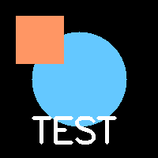
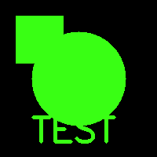
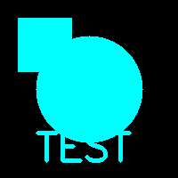
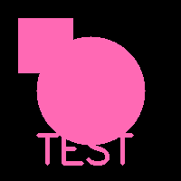
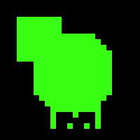
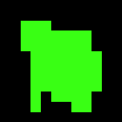

<div align="center">
  <h1>CyberLens</h1>
  <p><strong>Transform your photos into black-and-neon cyber art</strong></p>
  <p>A Python-powered image processing app that converts any photo into a stylized black-and-neon image with adjustable pixelation — giving it that sharp, retro cyber-art aesthetic.</p>

  <br />

  [](https://github.com/kousheyo-xx/CyberLens/blob/main/LICENSE)
  [](https://github.com/kousheyo-xx/CyberLens/stargazers)
  [](https://python.org)
  [](https://streamlit.io)
  [](https://opencv.org)

</div>

---

##  Demo

<div align="center">
  <table>
    <tr>
      <td align="center"><strong>Original</strong></td>
      <td align="center"><strong>Neon Green</strong></td>
      <td align="center"><strong>Cyan</strong></td>
    </tr>
    <tr>
      <td></td>
      <td></td>
      <td></td>
    </tr>
    <tr>
      <td align="center"><strong>Hot Pink</strong></td>
      <td align="center"><strong>Pixelated (8px)</strong></td>
      <td align="center"><strong>Pixelated (16px)</strong></td>
    </tr>
    <tr>
      <td></td>
      <td></td>
      <td></td>
    </tr>
  </table>
</div>

---

##  Features

-  **6 Neon Color Presets** — Neon Green, Cyan, Light Pink, Hot Pink, Electric Blue, Vivid Yellow
-  **Threshold Control** — Adjust the black/white cutoff to fine-tune contrast
-  **Pixelation Slider** — Go from smooth to chunky retro pixel art in real-time
-  **All Formats** — Supports JPG, PNG, BMP, TIFF, WebP
-  **One-Click Download** — Save your processed image as PNG
-  **Sleek Dark UI** — Built with Streamlit, styled with a premium cyber aesthetic

---

## How It Works

The processing pipeline has four steps:

| Step | Description |
|------|-------------|
| **1. Grayscale** | Convert the image from full color to grayscale using OpenCV |
| **2. Threshold** | Binary threshold — pixels darker than the limit become black, lighter become white |
| **3. Color Swap** | Using NumPy boolean indexing, every white pixel is swapped to your chosen neon color |
| **4. Pixelation** | Shrink the image down, then blow it back up with nearest-neighbor interpolation for sharp pixel blocks |

---

##  Getting Started

### Prerequisites

- Python 3.10 or higher
- pip

### Installation

```bash
# Clone the repo
git clone https://github.com/kousheyo-xx/CyberLens.git
cd CyberLens

# Install dependencies
pip install -r requirements.txt
```

### Run the App

```bash
streamlit run app.py
```

The app will open in your browser at `http://localhost:8501`.

### Run the Backend Test (CLI)

```bash
python test_backend.py <path_to_image>
```

This saves intermediate outputs (grayscale, threshold, each color, pixelation levels) into the `output/` folder.

---

##  Project Structure

```
CyberLens/
├── app.py              # Streamlit web UI
├── processor.py        # Core image processing backend
├── test_backend.py     # CLI test script
├── requirements.txt    # Python dependencies
├── test_input.png      # Sample input image
├── output/             # Sample outputs from test run
│   ├── 1_grayscale.png
│   ├── 2_threshold.png
│   ├── 3_color_*.png
│   ├── 4_pixelated_*.png
│   └── 5_final_pipeline.png
└── README.md
```

---

##  Tech Stack

| Tool | Role |
|------|------|
| **Python** | Core language |
| **NumPy** | Pixel-level manipulation & boolean indexing for color swaps |
| **OpenCV** | Image I/O, grayscale conversion, thresholding, nearest-neighbor resizing |
| **Streamlit** | Interactive web UI with sliders, dropdowns, and file upload |

---

##  Need Help?

Feel free to reach out or contribute!

-  [LinkedIn — Kousheyo Banerjee](https://www.linkedin.com/in/kousheyo-banerjee-ab9440392)
-  [Open an Issue](https://github.com/kousheyo-xx/CyberLens/issues/new/choose)

---

<div align="center">
  <p>Made by <a href="https://www.linkedin.com/in/kousheyo-banerjee-ab9440392">Kousheyo Banerjee</a></p>
</div>
